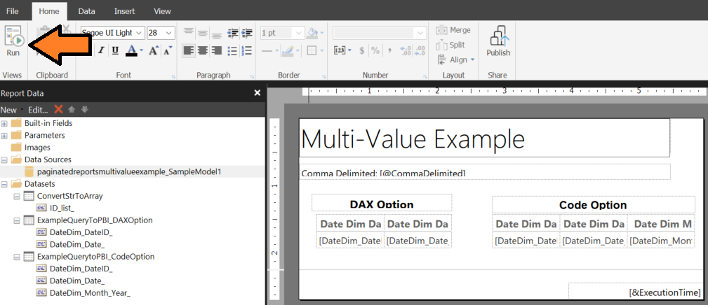

# paginated-reports-multivalue-example
Example of using comma delimited strings instead of multi-value parameters for a Power BI Paginated Report

## Table of Contents

## Prerequisites

1. Power BI Workspace with at least Member rights.

2. <a href="https://learn.microsoft.com/en-us/power-bi/paginated-reports/report-builder-power-bi?wt.mc_id=MVP_369005" target="_blank">Power BI Report Builder</a> installed on your machine.

# Installation Steps

1. Download the <a href="./Sample PBIX/SampleModel.pbix" target="_blank">example pbix file</a> and publish to your Power BI workspace of choice.  If you have not done this before, please <a href="https://learn.microsoft.com/en-us/power-bi/create-reports/desktop-upload-desktop-files?wt.mc_id=MVP_369005" target="_blank">see these instructions</a>.

1. Download the latest version of the example Paginated report <a href="https://github.com/kerski/paginated-reports-multivalue-example/releases" target="_blank">found in Releases</a>.
1. Open the Paginated Report with Report Builder.
1. Right-click on the data source located in the Data Source folder and select the "Edit Datasource" option.
    
1. Locate the SampleModel file you uploaded to your Power BI workspace and select it.
    
1. Navigate to the Home tab in the Paginated Report and select the Run button.
    
1. Enter a comma-delimited list of numbers (e.g. 101,102,103) and select Run Report.
    
1. Both the DAX option and Code Option will convert the comma-delimited string to an array and pass that into the DAX query using the RSCustomDAXFilter function.  If the installation is successful you should see a result similar to Figure 5.
    

